> 本文由 **Michael Ciurus** 发表于 raywenderlich ，[原文地址](https://www.raywenderlich.com/155815/reswift-tutorial-memory-game-app)。

> ReSwift 是用 Swift 实现的类似 Redux 的库。翻译这篇文章是在自己完全按照文章学习了一遍后，在文章的各个部分可能加入我自己的对于这个设计模式的一些见解，如有不对的地方，请各位大神指点。蟹蟹

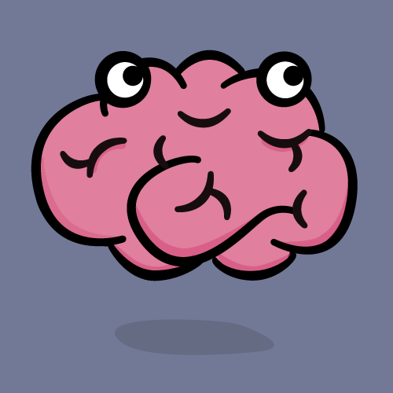

**Note:** 这个教程使用 Xcode 8 和 Swift 3。

随着 iOS 应用的大小不断增长， MVC 逐渐的不再成为设计模式的首选。

现在iOS开发者有很多可扩展的设计模式可供选择，例如 MVVM， VIPER 和 Riblets（小弟第一次听到这个模式，哎，还是太菜了）。他们看起来差别很大，但是他们都有一个共同的目标：在多向数据流的模式下将代码分割到单一职责的地方。在多向流中，数据在许多模块中以各种方向流动。

有些时候，你并不想（或需要）多向的数据流—你想要数据按照一个方向流动：那就是单向数据流。在这个 ReSwift 教程中，你想要摆脱常规路线并且学习如何使用 ReSwift 框架在一个状态复杂的 Memory Game app - MemoryTunes 中实现单向数据流。

首先- ReSwift 是什么？

## **介绍 ReSwift **

[ReSwift](https://github.com/ReSwift/ReSwift) 是一个小型的框架，帮助你在 Swift 中创建类似 [Redux](https://github.com/reactjs/redux) 的架构。
ReSwift 有四个主要的组件：

*  **Views:** 相应 **store** 的改变并且将他们展示在屏幕上。Views 发送 **Actions** 。
*  **Actions:** 在应用中 初始化一个 state 的改变。 一个 Action 被一个 Reducer 持有。
*  **Reducers:** 直接改变应用的 state，并且被存储在 **Store**  中。
*  **Store:**  存储当前应用状态的值。其他组件像 **Views** 可以订阅和相应它的改变。

ReSwift 有了许多优点：
* **严格的限制:** 我们很容易贪图方便将部分代码放在了不属于它的地方。ReSwift 对于将要发生什么和在哪里产生有严格的限制。
* **单向数据流:** 那些实现了多向数据流的应用的代码易读性不高并且难以调试。一个改变可以导致一些列的事件将数据发送到整个程序。单向流动更加容易预测并且大大降低了读取代码所需要的知识。
* **容易测试:** 大部分逻辑都包含在 Reducer 中，并且这是一个纯函数（纯函数的特点：必须要有一个输入值，并且一定会有返回值，只要输入值相同，它的返回值也一定是相同的，它的值不会受外界环境的影响）。
* **平台无关:** 所有 ReSwift 的元素- Stores, Reducers, 和 Actions --都是平台无关的。你可以很容易的在iOS， macOS， 或者 tvOS中复用。

## 多向数据流 vs. 单向数据流

为了展示我对数据流的理解，查看下面的栗子。一个应用在 VIPER 支持下在它的组件间实现了多向数据流:


与之相比，在 ReSwift 上构建应用的单向数据流：


因为数据只能按照一个方向流动，这更加直观地跟随代码并且追踪你应用中的问题。

## 让我们开始吧

一开始我们要下载一个最初的[项目](https://koenig-media.raywenderlich.com/uploads/2017/07/MemoryTunesStarterApp_starter.zip)，这里面包含了一些代码骨架和框架，包括 ReSwift，并且随着你的不断深入将会学到很多。

首先，你需要设置一下 ReSwift的纽带(wiring)。以设置应用的核心：state 为开始。

打开 `AppState.swift` 并且创建一个 `AppState` 结构体遵循 `StateType` 协议：

```swift
import ReSwift
struct AppState: StateType {
  
}
```

这个结构体将定义了应用的整个 state。

在你创建一个包含 `AppStore`  值的 `Store` 之前，你不得不创建主要的 `Reducer`。

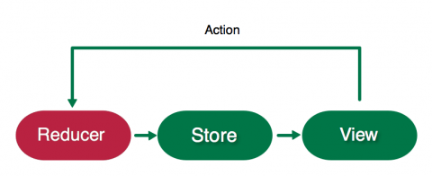

Reducers 是唯一的块可以直接改变当前 `AppState` 的值，并且被 `Store` 持有。只有 `Actions`可以初始化一个 `Reducer`来改变当前应用的状态。`Reducer` 根据它收到的 `Action` 的状态来改变当前的 `AppStore` 的值。

> **Note:** 在应用中只有唯一一个 `Store`，而且它只有唯一一个主要的 `Reducer`。

在 `AppReducer.swift` 中创建应用的主要的 `reducer`：
```swift
import ReSwift
func appReducer(action: Action, state: AppState?) -> {
  return AppState()
}
```

`AppReducer` 是一个接受一个 `Action` 参数和返回改变了的 `AppState` 的函数。`state` 是当前应用的状态；这个方法根据它收到的 `action` 的类型来改变 state。现在，这很容易就创建了一个新的 `AppState` 值---你将会将其返回一旦配置好了 `Store`。
因为 reducer 有了一个 state 所以是时候创建了个 Store 了，该做些行动了。
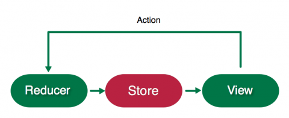

Store 包含了你的整个应用的状态：这就是你的 AppState 结构体的值。打开 `AppDelegate.swift` 并且用一下的代码替代 `import UIKit`:
```swift
import ReSwift
//TODO
var store = Store<AppState>(reducer: appReducer, state: nil)
```
这里通过传入 `appReducer` 来初始化一个全局的 `Store` 变量。`appReducer` 是 Stores 的主要的 Reducer，这里包含的说明表明了 store 是如何改变的当它收到一个 Action。因为这是最初的创建，而不是迭代的改变，所以你只需传入一个空的 state。
构建并且运行来保证应用得要编译:
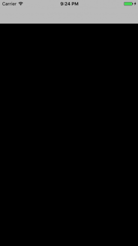


## 路由

是时候在应用中创建第一个实际的 state 了。你将从导航界面或者路由开始。
应用中的路由对于每个架构都是一个挑战，不只是 ReSwift。你将要在 MemoryTune中使用一种非常简单的方法，你要将所有的目的地(页面)定义在一个枚举类型中，并且你的 `AppState` 将会持有当前的目的地(页面)的值。`AppRouter` 将会相应它(enum)的值的变化并且将正确的页面显示在屏幕上。
打开 `AppRouter.swift` 并且用一下代码代替 `import UIKit`：
```swift
import ReSwift

enum RoutingDestination: String {
  case menu = "MenuTableViewController"
  case categories = "CategoriesTableViewController"
  case game = "GameViewController"
}
```

这个枚举类型代表了你的应用中的所有页面。

你终于有一些东西可以存储在应用的 State中。整个应用中只有唯一一个主state结构(`AppState` 在这个例子中)，但是你可以将应用的状态分成一些子状态并且被这个主state所引用。

因为这是一个很好的实践，所以你将要组织这些state变量放到子状态的结构总。打开`RoutingState.swift` 并且为路由添加一下子状态结构：

```swift
import ReSwift
struct RoutingState: StateType {
  var navigationState: RoutingDestination
  
  init(navigationState: RoutingDestination = .menu) {
    self.navigationState = navigationState
  }
}
```
`RoutingState` 包含了 `navigationState`---这代表了屏幕上的页面。

> **Note:**  `navigationState` 的默认值是 `menu`。如果你没有在路由初始化的时候指定它的状态，那么隐式地使它成为应用的默认值。

在 `AppState.swift` 中，将一下代码添加到结构体中:

```swift
let routingState: RoutingState
```

编译并运行，然而你会发现一个问题：

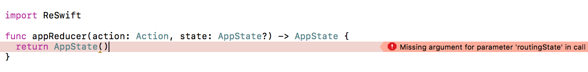

`appReducer` 不再被编译！这是因为你将 `routingState` 添加到 `AppState` ，但是并没有在默认的初始化中传递任何值。为了创建 `routingState`， 你需要一个 reducer。
只有一个主  `Reducer` 方法，但是就像 state 一样， reducers 应该被分成多个子 reducers。
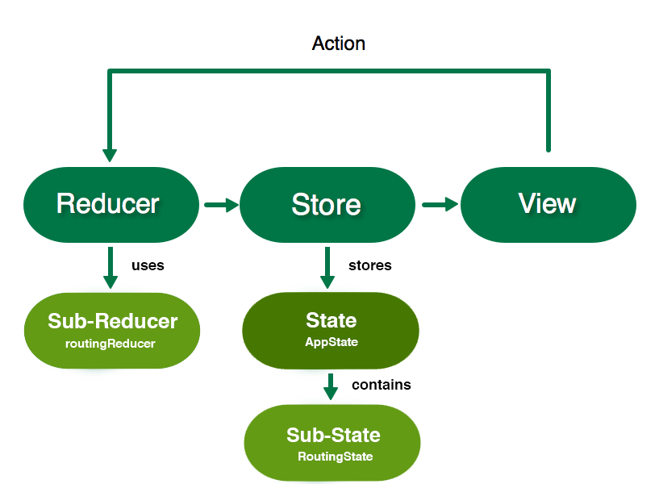

为了导航添加一下 `Reducer` 到 `routingReducer.swift` :
```swift
import ReSwift
func routingReducer(action: Action, state: RoutingState?) -> RoutingState {
  let state = state ?? RoutingState()
  return state
}
```

和主 `Reducer` 一样，`routingReducer` 改变 state 依据它收到的 action，然后就返回它。现在你还没有任何 actions， 所以现在创建一个新的 `RoutingState` 如果 `state` 是 nil 并且返回它。
子reducers 负责初始化与它们相关的子 states 的值。
回到 `AppReducer.swift` 来处理编译警告。修改 `appReducer` 的内容来与下面的相符合:

```swift
return AppState(routingState: routingReducer(action: action, state: state?.routingState))
```

在 `AppState` 初始化的时候添加 `routingState` 参数。从主 reducer 传入 `action` 和 `state` 到 `routingReducer` 来创建新的 state。熟悉这一套操作，因为你将会在你创建的子 `state` 和子 `reducer` 中重复这一动作。


## 订阅

还记得 `RoutingState` 中的默认值 `menu` 吗？这个确实是你的应用的当前状态。你不会在任何地方订阅它。
任何类都可以订阅  Store，不只是视图。当一个类订阅了 Store, 每当当前的 state 或者是 子 state 发生改变这个类都会收到通知。你将要在 `AppRouter` 做这些以便它在 `UINavigationController` 中改变当前的屏幕当 `routingState` 改变的时候。

打开 `AppRouter.swift`  并且用一下的代码替代 `AppRouter`:

```swift
final class AppRouter {
  let navigationController: UINavigationController
  
  init(window: UIWindow) {
    navigationController = UINavigationController()
    window.rootViewController = navigationController
    //1
    store.subscribe(self) {
      $0.select {
        $0.routingState
      }
    }
  }
  
  //2
  fileprivate func pushViewController(inentifier: String, animated: Bool) {
    let viewController = instantiateViewController(indetifier: indetifier)
    navigationController.pushViewController(viewController, animated: animated)
  }
  
  private func instantiateViewController(identifier: String) -> UIViewController {
   let storyboard = UIStoryboard(name: "Main", bundle: nil)
   return storybard.instantiateViewController(withIdentifier: indentifier)
  }
}

//MARK: - StoreSubscriber
//3
extension AppRouter: StoreSubscriber {
  func newState(state: RoutingState) {
    //4
    let shouldAnimate = navigaionController.topViewController != nil
    //5
    pushViewController(indetifier: state.navigationState.rawValue, animated: shouldAnimate)
  }
}
```

以上的代码，你更新了 `AppRouter` 并且添加了一个扩展。让我们看看这些是做什么的：
1. `AppState` 现在订阅了全局的 `store`。在闭包中， `select` 代表了你特意订阅了 `routingState` 的改变。
2. `pushViewController` 将被用来初始化和将给予的视图推到导航栈中。这里使用了`instantiateViewController`方法，这个方法根据传入的`identifier`来加载视图。
3. 使 `AppRouter` 遵循 `StoreSubscriber` 协议来获得`newState`回到当 `routingState` 发生改变。
4. 如果当前的是根视图控制器那么你将不需要动画，所以所以检查当前的目的地是否是推向根视图。
5. 当状态改变的时候，你将根据 `state.navigationState` 的 `rawValue`---这是视图控制器的名字，将新的目的地视图推向 `UINavigationController`。
6. `AppRouter` 现在将要相应初始值 `menu`并且将 `MenuTableViewController` 推到导航控制器中。

编译运行并查看：
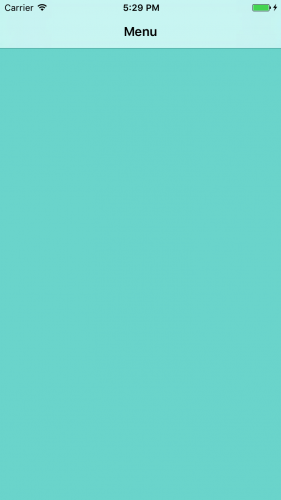

你的应用展示了空的 `MenuTableViewController` 。你将使用按钮来填充它，它将会导航到其他视图在下一章会讲述。


##  视图

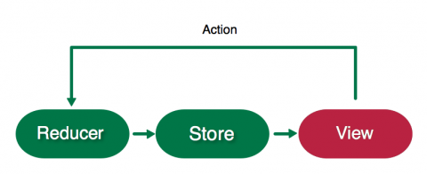

任何东西都可以作为 `StoreSubscriber` ，但通常来说是视图来相应状态的变化。你的目的是使 `MenuTableViewController` 展示两种不同的菜单按钮。是时候开始你的State/Reducer 操作了。
打开 `MenuState.swift` 并且创建一个状态和下面的一样：
```swift
import ReSwift
struct MenuState: StateType {
  var menuTitles: [String]
  
  init() {
    menuTitles = ["New Game", "Choose Category"]
  }
}
```

`MenuState` 包含了 `menuTitles`，你将使用这个来初始化显示在 table view 上的标题。
打开 `MenuReducer.swift` , 用以下的代码为这个状态创建一个 Reducer：
```swift
import ReSwift

func menuReducer(action: Action, state: MenuState?) -> MenuState {
  return MenuState()
}
```
因为 `MenuState` 是静态的，你不必担心状态的改变。所以就简单的返回了一个新的状态就好了。
回到 `AppState.swift`，在 `AppState` 的底部添加 `MenuState`。

```swift
let menuState: MenuState
```
编译器将会报错因为你又一次修改了默认的初始化操作。在`AppReducer.swift` 中，像下面一样修改 `AppState` 初始化：

```swift
return AppState(
  routingState: routingReducer(action: action, state: state?.routingState),
  menuState: menuReducer(action: action, state: state?.menuState)
)
```

现在你有了 `MenuState`，是时候订阅它了并且用它来渲染菜单视图了。
打开 `MenuTableViewController.swift`并且将原来的代码替换为下面的：
```swift
import ReSwift

final class MenuTableViewController: UITableViewController {
 //1
 var tableDataSource: TableDataSource<UITableViewCell, String?>
 
 override func viewWillAppear(_ animated: Bool) {
   super.viewWillAppear(animated)
   //2
   store.subscribe(self) {
     $0.select {
       $0.menuState
     }
   }
 }
 
 override func viewWillDisappear(_ animated: Bool) {
   super.viewWillDisappear(animated)
   //3
   store.unsubscribe(self)
 }
}

 // MARK: - StoreSubscriber
 extension MenuTableViewController: StoreSubscriber {
   func newState(state: MenuState) {
     tableDataSource = TableDataSource(cellIdentifier: "TitleCell", models: state.menuTitles) { cell, model in
     cell.textLable?.text = model
     cell.textLable?.textAlignment = .center
     return cell
     }
     tableView.dataSource = tableDataSource
     tableView.reloadData()
   }
 }
```
这个控制器现在订阅了 `MenuState`的变化并且声明式的渲染了状态。
1. `TableDataSource` 是被包含在了启动器中（starter）并且作为`UITableView`的一个声明式的数据源。
2. 在 `viewWillAppear` 中订阅 `menuState` 。现在每当`menuState` 改变的时候  ， 你将接收到 `newState` 的回调。
3. 退订，如果需要的话。
4. 这是声明的部分。这是你填充`UITableView` 的地方。你可以很清楚地看到代码中状态是如何转化到视图中的。


> **Note:** 你可能已经注意到了，ReSwift 喜欢不可变性-重度使用结构体（值引用）而不是对象。同样鼓励你来写声明式的UI代码。为什么呢？
>
> `newState` 回调--定义在`StoreSubscriber`  传递了状态的改变。你可能会在属性中捕获状态的值，就像这样：
>
> ```swift
>  final class MenuTableViewController: UITableViewController {
>    var currentMenuTitlesState: [String]
>    ....
>  }
> ```
 ```
> 但是编写声明式的UI代码清楚地显示了状态是如何转化成视图，这种方式更加干净。


净并且更加容易效仿。这个例子中的问题是 `UITableView `并没有声明式的API。这就是为什么我创建了 `TableDataSource.swift`。

编译并运行，你将看到菜单选项：
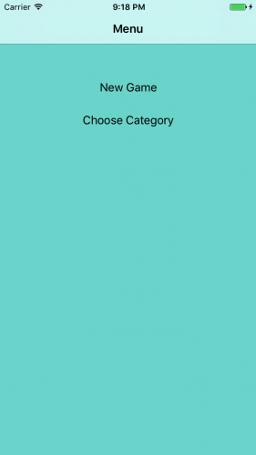


## 事件

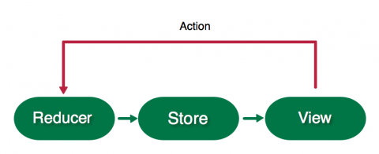

现在你有菜单选项，如果它们打开新的页面那么就会很棒。是时候写你的第一个事件了。
事件改变了Store。一个事件是一个简单的结构用来存储变量：事件的参数。一个 Reducer 持有一个被分发的时间并且根据事件的类型和它的参数来改变应用的状态。
在 `RoutingAction.swift` 中创建一个事件：

​```swift
import ReSwift

struct RoutingAction: Action {
  let destination: RoutingDestination
}
 ```

`RoutingAction` 改变当前的路由`destination`。

现在你将要分发 `RoutingAction` 当一个菜单按钮被点按。

打开 `MenuTableViewController.swift` 并且添加一下代码到 `MenuTableViewController`:

```swift
override func tableView(_ tableView: UITableView, disSelectRowAt indexPath: IndexPath) {
  var routeDestination: RoutingDestinationi = .categories
  switch(indexPath.row) {
    case 0: routeDestination = .game
    case 1: routeDestination = .categories
    default: break
  }
  //这里通过 store 分发了一个 actioin，这个 action 带有上面生成的 routeDestination
  store.dispatch(RoutingAction(destination: routeDestination))
}
```

这根据选中的 `row` 设置 `routeDestination`。然后使用 `dispatch` 来向 Store 传递 `routingAction`。

这个事件正在分发，但是它还没有被任何 reducer 支持。打开`RoutingReducer.swift` 并且将 `routingReducer` 中的内容替换成一下的代码-更新状态：

```swift
var state = state ?? RoutingState()

switch action {
  case let routingAction as RoutingAction:
  	state.navigationState = routingAction.destination
  default: break
}

return state
```

这个 `switch` 检查传递来的 `action` 是否是一个 `RoutingAction`。如果是，它就用这个 `destination` 来改变 `RoutingState`，然后返回它。

编译和运行。现在当你点击菜单按钮，正确的视图控制器就会被推到导航控制器的顶端。


## 更新状态

你可能发现了当前导航器实现中的循环。当你点击 `New Game` 按钮选项，`RoutingStata` 的 `navigationState` 从`menu `变成了`game`。但是当你使用导航控制器的返回箭头来返回到菜单界面的时候， `navigationState` 没有发生任何改变。

在 ReSwift中，保持状态与当前的UI状态的同步是很重要的。我们很容易将这点忘记当UIKit帮我们完全搞定这些事，就像导航器返回按钮或者用户在 UITextField中打字。

每当 `MenuTableViewController` 出现就更新 `navigationState`，通过这种方法来修复这个bug。

```swift
store.dispatch(RoutingAction(destination: .menu))
```

如果导航器的返回箭头被使用那么就手动更新store。

运行应用并且再次测试导航。。。啊啊。。。。现在导航已经完全坏了。没有页面能够被推入，而且你可能会看到应用奔溃。

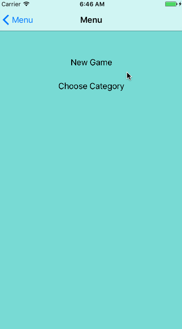

打开 `AppRouter.swift` ；你应该会想到，每当收到一个新的 `navigatioinState`，`pushViewController`都会被调用一次。

你不得不动态检查 `MenuViewController`在推送之前是否已经可见。用一下代码替代 `pushViewController`的内容：

```swift 
let viewController = instactiateViewController(indentifier: identifier)
let newViewControllerType = type(of: viewController)
if let currentVc = navigationController.topViewController {
  let currentViewControllerType = type(of: currentVc)
  if currentViewControllerType == newViewControllerType {
    return
  }
}

navigationController.pushViewController(viewController, animated: animated)
```

在当前的视图控制器中调用 `type(of:)` 并且和将要被推入的新的视图相比较。如果它们符合，就直接 `return`并不需要将重复的视图控制器推入。
编译和运行程序，导航器将和往常一样工作，当你退出当前栈时 `menu` 的状态也会随着改变。
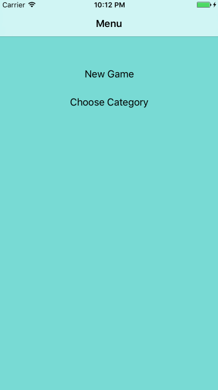

UI事件来更新状态和动态检查当前状态是十分复杂的。这是一个你必须克服的挑战之一当你使用ReSwift。幸运的是，这不会经常发生。


## 目录

现在你将更进一步来实现一个更加复杂的页面：`CategoriesTableViewController`。你需要允许用户选择音乐的类别，所以当他们在玩游戏的时候能够欣赏他们最喜欢的乐队了。从添加状态到 `CategoriesState.swift`开始：
```swift
import ReSwift

enum Category: String {
  case pop = "Pop"
  case electronic = "Electronic"
  case rock = "Rock"
  case metal = "Metal"
  case rap = "Rap"
}

struct CategoriesState: StateType {
  let categories: [Categories]
  var currentCategorySelected: Category
  
  init(currentCategory: Category) {
    categories = [.pop, .electronic, .rock, .metal, .rap]
    currentCategorySelected = currentCategory
  }
}
```
这个 `enum` 定义了几种音乐类别。`CategoriesState` 包含了一些列可用的`categories`并且还有保存状态的`currentCategoriesSelected`。

在`ChangeCategoriesAction.swift`中添加一下代码：
```swift
import ReSwift

struce ChangeCategoryAction: Action {
  let categoryIndex: Int
}
```

这个创建了一个可以改变`CategoriesState`的事件，使用 `categoryIndex`来联系音乐类别。
现在你需要实现一个 `Reduce`来接受 `ChageCategoryAction`并且存储更新后的状态。打开 `CategoriesReducer.swift` 并且添加一下代码：
```swift
import ReSwift

private struce CategoriesReducerConstants {
  static let userDefaultsCategoryKey = "currentCategoryKey"
}

private typelias C = CategoriesReducerConstants

func categoriesReducer(action: Action, state: CategoriesState?) -> CategoriesState {
  var currentCategory: Category = .pop
  
  //1
  if let loadedCategory = getCurrentCategoryStateFromUserDefaults() {
   currentCategory = loadedCategory 
  }
 var state = state ?? CategoriesState(currentCategory: currentCategory)
 
 switch action {
   case let changeCategoryAction as changeCategoryAction:
   //2
   let newCategory = state.categories[changeCategoryAction.categoryIndex]
   state.currentCategorySelected = newCategory
   saveCurrentCategoryStateToUerDefaults(category: newCategory)
   default: break
 }
 return state
}

//3
private func getCurrentCategoryStateFromUserDefaults() -> Category? {
 let userDefaults = UserDefault.standard
 let rawValue = userDefault.string(forKey: C.userDefaultsCategoryKey)
 if let rawValue = rawValue {
   retunr Category(rawValue: rawValue)
 } else {
   return nil
 }
}

//4
private func saveCurrentCategoryStateToUserDefault(category: Category) {
  let userDefaults = UserDefaults.standard
  userDefaults.set(category.rawValue, forKey: C.userDefaultsCategoryKey)
  userDefaults.sychronize()
}
```

就想其他的reducers一样，这实现了一个方法来完成状态的更新。在这个例子中，你也将已选中的类别存入 `UserDefaults`。简要的看一下这都做了些什么：

1. 如果可能的话从 `UserDefaults` 中加载当前的lei'bie类别，并且用它来实例化一个 `CategoriesState` 如果不存在的话。
2. 通过更新`state `  和保存新的类别到 `UserDefault` 来响应 `ChangeCategoryAction`。
3. `getCurrentCategoryStateFromUserDefaults` 是一个辅助方法从 `UserDefaults`中加载类别。
4. `saveCurrentCategoryStatetoUserDefaults` 是一个辅助方法来将类别保存到 `UserDefaults`。

这些辅助方法也同样是全局的纯函数。打开 `AppState.swift` 并且将一下的添加到  `struct`的末尾：

```swift
let categoriesState: CategoriesState
```

`categoriesState` 现在是 `AppState` 的一部分了。你将要管理这部分！

打开 `AppReducer.swift` 并且修改返回值来匹配一下的代码：

```swift
return AppState(
  routingState: routingReducer(action: action, state: state?.routingState),
  menuState: menuReducer(action: action, state: state?.menuState),
  categoriesState: categoriesReducer(action: action, state: state?.categoriesState)
)
```

你已经将 `categoriesState` 添加到 `appReducer` 传递了 `action` 和 `categoriesState`。

现在你需要创建类别页面，就想 `MenuTableViewController`一样。你将要使它订阅Store并且使用 `TableDataSource`。

打开 `CategoriesTableViewController.swift` 并且用一下的代码替代：

```swift
import ReSwift

final class CategoriesTableViewController: UITableViewController {
  
  var tableDataSource: TableDataSource<UITableViewCell, Category>?
  
  override func viewWillAppear(_ animatedL: Bool) {
    //1
    store.subscribe(self) {
      $0.select {
        $0.categoriesState
      }
    }
  }
  
  override func viewWillDisappear(_ animated: Bool) {
    super.viewWillDisappear(animated)
    store.unsubscribe(self)
  }
  
  override func talbeView(_ tableView: UITableView, didSelectRowAt indexPath: IndexPath) {
    //2
    store.dispatch(ChangeCategoryAction(categoryIndex: indexPath.row))
  }
}

//MARK: - StoreSubscriber
extension CategoriesTableViewController: StoreSubscriber {
  func newState(state: CategoriesState) {
    tableDataSource = TableDataSource(cellIdentifier: "CategoryCell", models: state.categories) { cell, model in
    cell.textLable?.text = model.rawValue
    //3
    cell.accessoryType = (state.currentCategorySelected == model) ? .checkmark : .none
    return cell
    }
    self.tableView.dataSource = tableDataSource
    self.tableView.reloadData()
  }
}
```

这里的代码和 `MenuTalbeViewController` 十分相似。看一下亮点的部分：

1. 在 `viewWillAppear` 中订阅 `categoriesState` 的变化并且在 `viewWillDisappear` 中取消订阅。
2. 当用户选择一个cell的时候分发 `ChangeCategoryAction`。
3. 在 `newState`中，当前被选中的cell添加标记。

所有的事情都做好了。现在你可以选择一个类别了。编译和运行程序，为你自己选择一个 `Choose Category` 。

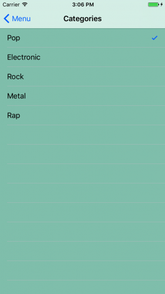


## 异步任务

[异步操作很难？](https://ashfurrow.com/blog/comparative-asynchronous-programming/) 嗯？对于ReSwift来说并不是。

你将要从 [iTunes API](https://affiliate.itunes.apple.com/resources/documentation/itunes-store-web-service-search-api/) 下载图片给 Memory Cards。首先，你要创建一个游戏state, reducer和相关的 action。

打开 `GameState.swift` 并且你将会看到一个  `MemoryCard`  结构体代表了一个游戏卡。他包含了显示在卡上的图片的 `imageUrl` 。 `isFliped` 代表了前一张牌是否可见并且 `isAlreadyGuessed` dai'bi代表了卡片是否匹配。

你将要在文件中添加游戏状态。从导入 ReSwift 开始：

```swift
import ReSwift
```

现在添加一下代码到文件的底部：

```swift
struce GameState: StateType {
  var memoryCards: [MemoryCard]
  //1
  var showLoading: Bool
  //2
  var gameFinished: Bool
}
```

这些定义了游戏的状态。除了包含可用的卡片的数组外，这里的属性代表了：

1. 加载指示器是否可见
2. 游戏是否结束

在 `GameReducer.swift` 中添加一个game Reducer:

```swift
import ReSwift

func gameReducer(action: Action, state: GameState?) -> GameState {
  let state = state ?? GameState(memoryCard: [], showLoding: false, gameFinished: false)
  return state
}
```

目前仅仅是创建了一个新的 `GameState`。你等会儿还会回来。

在 `AppReducer.swift` 中，最后一次更新初始化操作：

```swift
return AppState(
  routingState: routingReducer(action: action, state: state?.routingState),
  menuState: menuReducer(action: action, state: state?.menuState),
  categoriesState: categoriesReducer(action:action, state: state?.categoriesState),
  gameState: gameReducer(action: action, state: state?.gameState))

```

> **Note:**  在做了几次  `Action/Reducer/State` 常规操作后你会注意到所有的事情都是可预测的、简单和熟悉。这编程友好的常规操作得益于 ReSwift 的单向的本质并且在每个组件中严格的限制了它。可能你已经学到了，只有  Reducer 可以改变 app Store并且只有 Action 可以初始化那个变化。你也立刻就知道到哪里去看，和到哪里去添加新的代码。

现在定义一个事件来更新卡片通过添加一下的代码到 `SetCardsAction.swift` :

```swift 
import ReSwift

struct SetCardsAction: Action {
  let cardImageUrls: [String]
}
```

在 `GameState` 中这操作为卡片设置了图片地址。

现在你将要创建你的第一个异步事件。在 `FetchTunesAction.swift` 中，添加一下代码：

```swift
import ReSwift

func fetchTunes(state: AppState, store<AppState>) ->FetchTunesAction {
  iTunesAPI.searchFor(category: state.categoriesState.currentCategorySelected.rawValue) { imageUrls in
    store.dispatch(SetCardsAction(cardImageUrls: imageUrls))
  }
  return FetchTunesAction()
}

struct FetchTunes: Action {
  
}
```

`fetchTunes` 通过使用 `iTunesAPI`  (包括启动装置(starter)) 来获取图片。在闭包中，你分发了一个 带有结果`SetCardAction` 事件。在 ReSwift中操作异步任务就是那么简单：当它完成时，及时分发一个事件。就是这样。

`fetchTunes` 返回了 `FetchTunesAction` ,被用来表示获取已经开始了。

打开 `GameReducer.swift` 并且为两个新的事件添加支持。用一下的代码提到 `gameRedcer` 中的内容：

```swift
var state = state ?? GameState(memoryCards: [], showLoading: false, gameFinished: false)

switch(action) {
  //1
  case _ as FetchTunesAction:
  	state = GameState(memoryCards: [], showLoading: true, gameFinished: false)
  	//2
  	case let setCardsAction as SetCardsAction:
  		state.memoryCards = generateNewCards(with: setCardsAction.cardImageUrls)
  		state.showLoading = false
  	default: break
}

return state
```

 你改变状态使其成为常量，然后再实现一个 `action`，switch做了一下事情：

1. 当action为 `FetchTunesAction` ，设置了 `showLoading` 为 `true`。
2. 当action为 ` setCardsAction `， 随机化卡组并且设置 `showLoading` 为 `false`。`generateNewCards` 可以在 `MemoryGameLogic.swift` 中被找到，这包含了启动装置。

是时候在 `GameViewController` 中画出卡片了。以这是cell开始。

打开 `CardCollecionViewCell.swift` 并且添加一下方法到 `CardCollectionViewCell` 的底部：

```swift
func configureCell(with cardState: MemoryCard) {
  let url = URL(string: cardState.imageUrl)
  //1
  cardImageView.kf.setImage(with: url)
  //2
  cardImageView.alpha = cardState.isAlreadyGuessed || cardState.isFlipped ? 1 : 0
}
```

`configure` 做了一下事情：

1. 使用很棒的 `Kingfisher` 库（喵神写的，膜拜~）来存储图片。
2. 当卡片已经被猜出或者卡片被翻转时显示图片。

接下来你将要实现 collection view 来展示卡片。就像table views那样，对UICOllectionView有个声明式的包装叫`CollectionDataSource.swift` ，这些都被包含在启动器中并且你将会在之后所利用。

打开`GameViewController`，将一下代码添加到 `showGameFinishedAlert` 的上面：

```swift
var collectionDataSource: CollectionDataSource<CardCollectionViewCell, MemoryCard>?

override func viewWillAppear(_ animated: Bool) {
  super.viewWillAppear(animated)
  store.subscribe(self) {
    $0.select {
      $0.gameState
    }
  }
}

override func viewWillDisappear(_ animated: Bool) {
  super.viewWillDisappear(animated)
  store.unsubscribe(self)
}

override func viewDidLoad() {
  // 1
  store.dispatch(fetchTunes)
  collectionView.delegate = self
  loadingIndicator.hidesWhenStopped = true
  
  // 2
  collectionDataSource = CollectionDataSource(cellIdentifier: "CardCell", models: [], configureCell: { (cell, model) -> CardCollectionViewCell in
    cell.configureCell(with: model)
    return cell
  })
  collectionView.dataSource = collectionDataSource
}
```

注意这里可能会导致编译警告直到你实现了 `StoreSubscriber` 协议。视图在 `viewWillAppear` 中订阅了 `gameState` 并且在 `viewWillDisappear` 中取消了订阅。在 `viewDidLoad` 中做了一下事件：
1. 当开始从 iTunes API 获取图片时分发 `fetchTunes`。
2. 通过使用 `CollectionDataSource` - 获取合适的 `model` 给 `configureCell`  来设置cells。


现在你需要添加一个扩展来遵循`StoreSubscriber`。在文件的底部添加一下代码：

```swift
// MARK: - StoreSubscriber
extension GameViewController: StoreSubscriber {
  func newState(state: GameState) {
    
    collectionDataSource?.models = state.memoryCards
    collectionView.reloadData()
    
    // 1
    state.showLoading ? loadingIndicator.startAnimating() : loadingIndicator.stopAnimating()
    
    // 2
    if state.gameFinished {
      showGameFinishedAlert()
      store.dispatch(fetchTunes)
    }
  }
}
```

这实现了 `newState` 来持有状态的改变。这改变了数据源同时：

1. 根据状态来改变加载指示器的状态。
2. 重新一场游戏和显示提示当游戏结束的时候。

编译和运行游戏，选择 `New Game` ，并且你现在可以看到 mrmory 卡片。

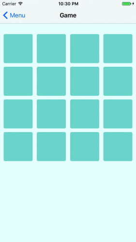

## 玩游戏

游戏的逻辑是用户点击两张卡片，如果它们相同，它们保持正面；如果它们不相同，它们将再次隐藏。玩家的目标是用最少的步数使所有卡片都为正面。
为了做到，你需要一个点击的事件。打开`FlipCardAction.swift` 并且添加一下代码：
```swift
import ReSwift

struct FlipCardAction: Action {
  let cardIndexToFlip: Int
}
```

`FlipCardAction` 将会使用 `cardIndexToFlip` 来更新 `GameState` 当一张卡片被点击了。
更改`gameReducer` 来支持 `FlipCardAction`和游戏的算法。打开 `GameReducer.swift`并且在`default` 之前添加一下的例子：
```swift
case let flipCardAction as FlipCardAction:
  state.memoryCards = flipCard(index: flipCardAction.cardIndexToFlip, memoryCards: state.memoryCards)
  state.gameFinished = hasFinishedGame(cards: state.memoryCards)

```
对于一个 `FlipCardAction`来说, `flipCard` 根据 `cardIndexTiFlip`和其他游戏逻辑来改变 memory cards 的状态。 `hasFinishedGame` 被调用来确定游戏是否结束和相应的更新状态。两个方法都可以在`MemoryGameLogic.swift` 中找到。

最后一块拼图是发送一个点击事件当卡片被选中了。这会完成游戏的逻辑并且使得相关的状态变化。

在`GameViewController.swift` 中，找到 `UICollectionViewDelegate` 扩展。添加一下代码到`collectionView(_: didSelectItemAt:) ` :

```swift
store.dispatch(FlipCardAction(cardIndexToFlip: indexPath.row))
```

当collection view 中的卡片被选中了，相关连的`indexPath.row` 将被发送到 `FlipCardAction`。

运行游戏，现在你可以玩游戏了。当你玩的开心的时候记得回来。

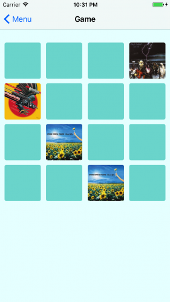

## 接下来干什么呢？

你可以在[这里](https://koenig-media.raywenderlich.com/uploads/2017/07/MemoryTunesStarterApp_finished.zip) 下载最终的 `MemoryTunes`。
接下来任然有许多 ReSwift相关的需要学习。

## 相关资料：

* [ReSwift 介绍](http://limboy.me/tech/2016/12/04/reswift-analyze.html)
* [The Right Way to Architect iOS App with Swift](http://limboy.me/tech/2017/06/22/the-right-way-to-ios-architecture.html)